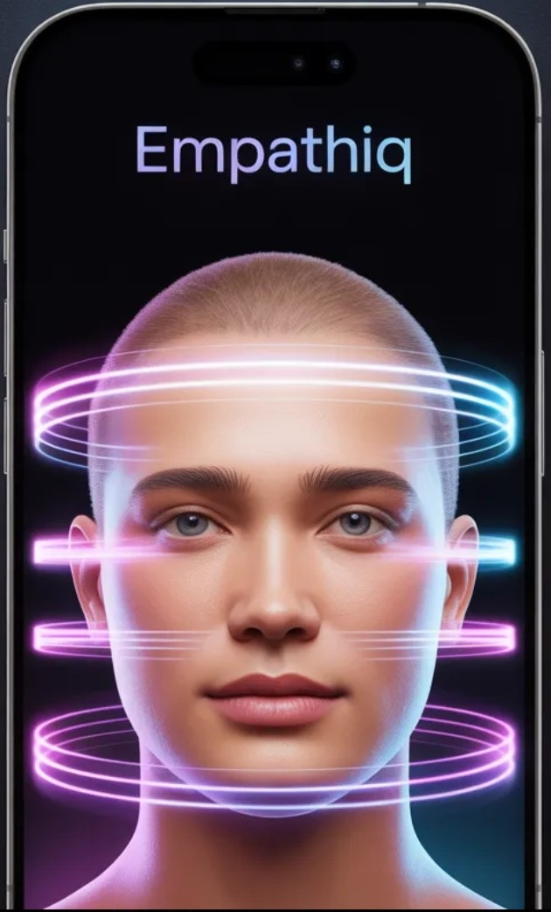
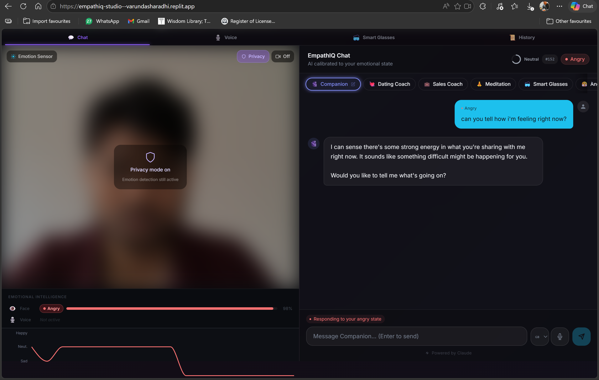
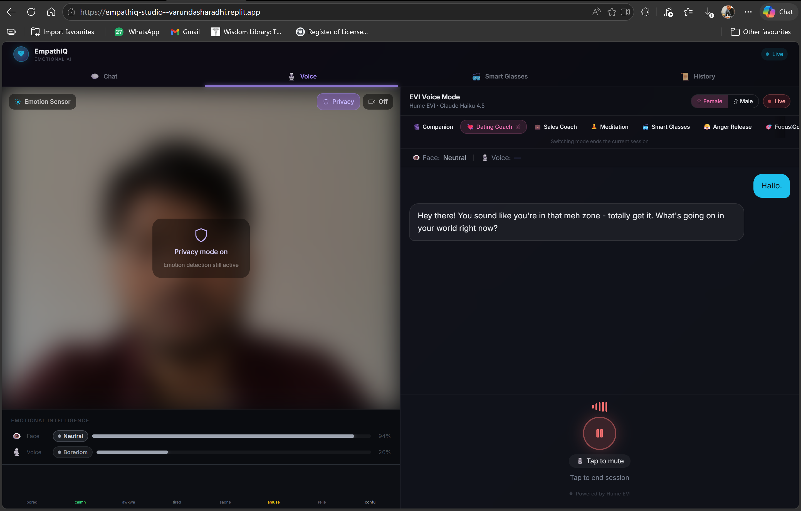
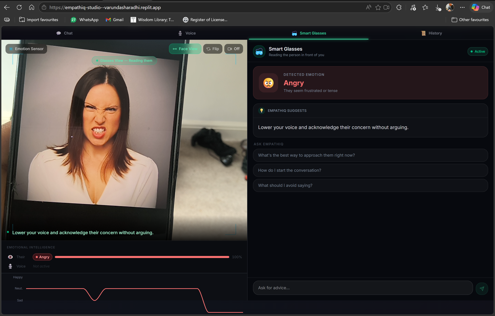
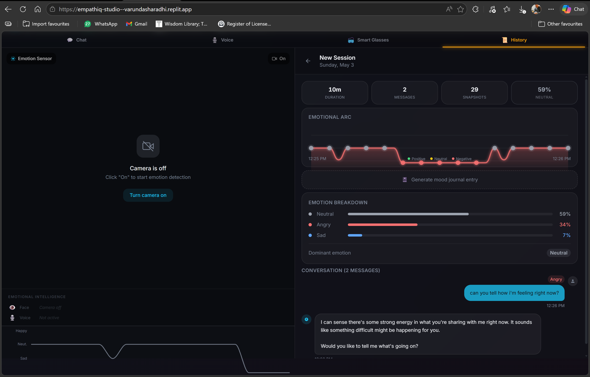

# EmpathIQ 🧠❤️

> Real-time emotional intelligence AI that reads your face + voice 
> and responds like someone who truly understands you.

## 🔗 Live Demo
👉 https://empathiq-studio-api-server.vercel.app/app — live on Vercel (landing at `/`, app at `/app`)

## 🎬 Demo Video
👉 https://www.loom.com/share/ee3177d34b40404487115fca5f8366ed

---

## 📸 Screenshots

### 💬 Chat Mode — Emotion Detected & Claude Responding

### 🎙️ Voice Mode — Hume EVI Live

### 🥽 Smart Glasses — Reading Someone Else's Emotion

### 📊 History — Emotional Arc & Session Analytics

---

## ✨ Features
- 👁️ Live facial emotion detection (face-api.js)
- 🎙️ Hume EVI voice mode — emotionally expressive AI voice
- 🧠 Face + voice emotion fusion panel
- 🥽 Smart Glasses mode — reads OTHER person's emotions
  and gives you real-time coaching on what to say
- 📊 Session history with Emotional Arc analytics
- 9 modes: Therapist, Dating Coach, Sales Coach, Meditation,
  Focus Coach, Sleep Guide, Confidence Booster, 
  Anger Release, Smart Glasses
- Privacy mode, male/female voice toggle

## 🛠️ Built With
- React + Vite
- Claude API (Anthropic) 
- Hume EVI (voice emotion AI)
- face-api.js
- Recharts
- Tailwind CSS

## 🚀 Setup (local)
This is a pnpm workspace monorepo (Node 24).
1. Clone the repo
2. Add API keys to `artifacts/api-server/.env`:
   - `ANTHROPIC_API_KEY`
   - `HUME_API_KEY`
3. `pnpm install`
4. Build + run:
   - API: `pnpm --filter @workspace/api-server run dev` (Express on `:8080`)
   - Web: `pnpm --filter @workspace/empathiq run dev` (Vite on `:3000`, proxies `/api` → `:8080`)

## ☁️ Deployment (Vercel)
Deployed as a single full-stack Vercel project — Vite frontend served as static files, the Express API bundled as a serverless function.
- Config: [`vercel.json`](./vercel.json) at the repo root. Builds the libs + API bundle + frontend, then routes `/api/*` to the serverless function (`api/index.mjs`) and `/app` → `/app.html`.
- Required Vercel **project settings**: Root Directory = repo root, Framework Preset = `Other`, env vars `ANTHROPIC_API_KEY` + `HUME_API_KEY`.
- Pushing to `main` triggers a production deploy via the GitHub integration.
- Note: session history is in-memory (resets on serverless cold starts); chat/voice/coaching are stateless.

## 🔮 Future Vision
- Meta smart glasses integration
- Apple Watch pulse + biometric fusion
- Dating coach, sales assistant, detective mode via glasses
- Clinical/HIPAA compliant therapy version

## 🏆 Built For
Replit 10 Buildathon — May 2026 — Built solo in 24 hours

## 👤 Author
Varun Dasharadhi

## License
© 2026 Varun Dasharadhi. All Rights Reserved.

EmpathIQ is proprietary software. Unauthorised copying, 
modification, or distribution is strictly prohibited.

For licensing or partnership enquiries contact:
dasharadhivarun@gmail.com
